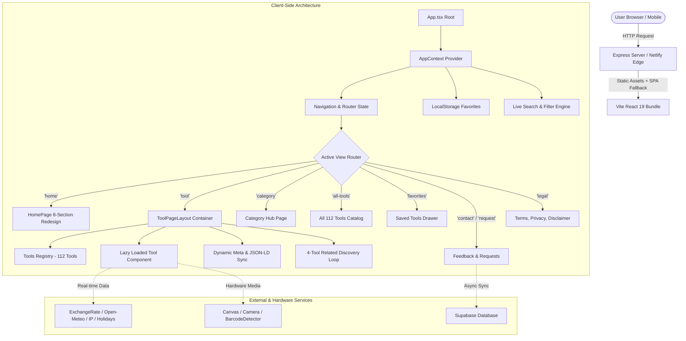

# Architecture & System Design

**Application:** BharatUtility — India's Utility Super-Site  
**Repository:** `c:\Users\USER\Desktop\bharatutility`  

---

## 1. High-Level System Overview

BharatUtility is built as an ultra-fast, high-performance, single-page application (SPA) optimized for zero-latency instant calculation, mobile responsiveness, and 100% client-side privacy.



---

## 2. Core Architectural Pillars

### A. Centralized Tool Registry Pattern
The single source of truth for the entire ecosystem is `src/data/toolsRegistry.ts`. Every tool is registered with strict TypeScript typing:
```typescript
export interface Tool {
  id: ToolId;
  name: string;
  category: CategoryId;
  description: string;
  shortDescription?: string;
  icon: string;
  path: string;
  badge?: 'Popular' | 'New' | 'Essential' | 'Updated' | 'Trending';
  keywords: string[];
  featured?: boolean;
  relatedTools?: ToolId[];
  seoTitle?: string;
  seoDescription?: string;
  formula?: string;
  formulaDescription?: string;
}
```
- **Benefits:** Guaranteed consistency across sitemap generators, SEO validators, homepage grids, category views, and internal recommendation engines.

### B. Dynamic Tool Page Layout Engine (`ToolPageLayout.tsx`)
Rather than duplicating layout boilerplate across 112 tools, `ToolPageLayout.tsx` acts as the universal host container:
1. **Dynamic Header & Breadcrumb:** Category name, active tool title, short description, and badge.
2. **Action Strip:** Quick favorite toggle, copy shareable URL with toast notification, print/export triggers.
3. **Lazy-Loaded Tool Viewport:** Dynamically mounts the specific tool calculator or utility widget.
4. **Formula & Calculation Logic Accordion:** Explains mathematical formulas (e.g., Reducing balance EMI formula, CPCB AQI sub-index equations) for high user trust.
5. **Cross-Tool Discovery Loop:** Guarantees 4 high-relevance related tool recommendations with category fallbacks, ensuring zero dead-ends for visitors.

### C. Client-Side Privacy Guarantee
- All document manipulations (PDF merge/split/compress, Passport Photo cropping, QR generation/scanning) execute strictly in the client's V8 / JavaScript thread using WebAssembly and HTML5 Canvas.
- No files, personal financial records, salary figures, or images are ever transmitted to external servers.

### D. Real-Time SEO & Structured Data Synchronization
Whenever navigation occurs in `AppContext.tsx`:
- `document.title` is updated with high-converting, keyword-targeted Indian search terms.
- `<meta name="description">`, OpenGraph (`og:title`, `og:description`, `og:url`), and Twitter cards are synchronized.
- Injects rich **JSON-LD Schema** (`WebApplication` / `SoftwareApplication`) with rating, operating system compatibility, and pricing indicators.

---

## 3. Server Architecture (`server.ts` & `dist/server.cjs`)

- **Express v4 Application:**
  - Serves static assets from `dist/` with immutable caching headers for hashed assets.
  - Implements SPA wildcard fallback routing (`* -> index.html`).
  - Exposes health probe endpoints:
    - `GET /api/health` -> `{ status: "ok", uptime: ..., timestamp: ... }`
    - `GET /api/admin/health-check` -> System diagnostic payload for ARRJS central admin dashboard.
  - Development mode leverages `vite.createServer` with Vite middleware for fast HMR.
