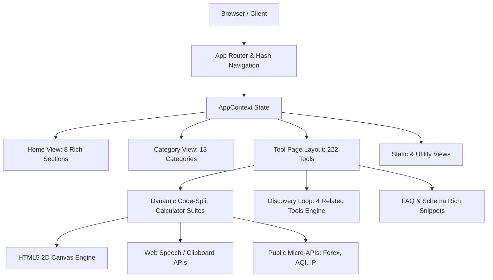

# Architecture & System Design — BharatUtility

## Architectural Philosophy
BharatUtility is engineered as an **Offline-First, Zero-Latency Indian Utility Super-Site**. Computations, conversions, and document processing happen entirely client-side in the user's browser, eliminating server bottlenecks and guaranteeing 100% user data privacy.

## 1. Single Page Application (SPA) & Routing Architecture
- **Router State:** `src/context/AppContext.tsx` orchestrates routing state via URL hash/pathname detection (`window.location.hash` and pushState).
- **Supported View Modes:**
  - `home`: The 8-section homepage featuring Hero search, Popular tools, Categorized tools, You-May-Also-Need discovery, Live stats, FAQ, and Final CTA.
  - `tool`: Specialized container (`ToolPageLayout.tsx`) with category breadcrumbs, action bar (Print, Share, Favorite, Feedback), calculator viewport, worked examples, and structured FAQ schema.
  - `category`: Category-filtered directory of tools.
  - `all-tools`: Complete directory of all 222 tools with live multi-filter search.
  - `favorites`: User-saved bookmarks stored in local storage.
  - `contact`: Contact support form with Supabase persistence.
  - `request-tool`: Feature request form with Supabase persistence.
  - `legal`: Dynamic terms, privacy policy, disclaimer, and editorial policies.

## 2. Dynamic Code-Splitting & Modular Bundling
- Each calculator suite is isolated into a dynamic `React.lazy()` bundle chunk (`EmiCalculator`, `CurrencyConverterSuite`, `OnlineNotepadSuite`, `OnlinePaintCanvasSuite`, etc.).
- Initial page payload is lightweight (~220 KB gzip), ensuring rapid Largest Contentful Paint (LCP) and instant interaction across low-bandwidth 4G/5G mobile connections.

## 3. SEO & Structural Data Engine
- Automated build-time sitemap generator (`scripts/generate-sitemap.ts`) maps every tool, category, and legal route into `public/sitemap.xml`.
- Runtime `BreadcrumbList`, `SoftwareApplication`, and `FAQPage` JSON-LD schemas injected on all tool views to maximize Google Rich Result snippets.
