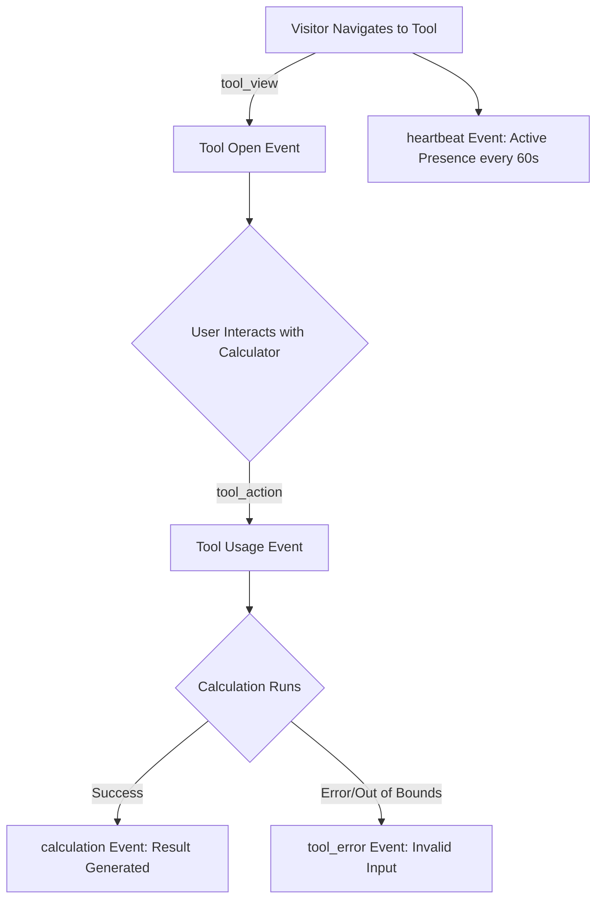

# BharatUtility — Telemetry & Analytics Architecture Audit Report

**Date**: September 19, 2026  
**Projects Audited**:
1. `bharatutility` (Client Web Application)
2. `arrjs-central-admin` (ARRJS Central Admin Portal)  
**Database**: Supabase PostgreSQL (`site_analytics_events` table)  
**Target URL**: `https://bharatutility.tech`  

---

## 1. Executive Summary

This comprehensive audit inspected the end-to-end telemetry pipeline:
```
BharatUtility User Action 
  → Visitor & Session Identifier Engine
  → Telemetry Event Dispatcher 
  → Supabase (site_analytics_events) 
  → ARRJS Central Admin Analytics Engine 
  → Platform Intelligence Dashboard
```

The audit identified critical bugs, architectural limitations, data quality issues, and security/privacy risks in the legacy implementation, and provides a structured, privacy-preserving redesign.

---

## 2. Current Architecture & Data Flow

### A. Data Source & Generation
* **Frontend Client (`bharatutility`)**:
  * `src/services/analyticsService.ts`: Singleton class managing event creation, client geolocation, and local storage fallback.
  * `src/context/AppContext.tsx`: Subscribes to route navigation and dispatches `trackView` on view transitions (`tool_view` or `page_view`).
  * `addCalculationHistory`: Dispatches `trackAction('calculation', ...)` when tools produce results.

### B. Database Schema (`site_analytics_events`)
```sql
CREATE TABLE public.site_analytics_events (
  id UUID DEFAULT gen_random_uuid() PRIMARY KEY,
  site_id VARCHAR(50) NOT NULL DEFAULT 'bharatutility',
  event_type VARCHAR(50) NOT NULL, -- 'tool_view', 'page_view', 'calculation', 'favorite', 'share', 'search', 'heartbeat', 'tool_error'
  target_slug VARCHAR(100) NOT NULL,
  target_name TEXT,
  category VARCHAR(50),
  ip_address VARCHAR(50),
  city VARCHAR(100),
  region VARCHAR(100),
  country VARCHAR(50) DEFAULT 'India',
  country_code VARCHAR(10) DEFAULT 'IN',
  device VARCHAR(20) DEFAULT 'desktop',
  browser VARCHAR(50),
  os VARCHAR(50),
  source VARCHAR(50) DEFAULT 'direct',
  referrer TEXT,
  details TEXT,
  created_at TIMESTAMPTZ NOT NULL DEFAULT NOW()
);
```

### C. Admin Consumption (`arrjs-central-admin`)
* `src/services/analyticsService.ts`: Polls `site_analytics_events` every 15–20s, caches events in memory, and aggregates metrics for ranges (`today`, `7d`, `30d`, `90d`).
* `src/components/admin/sections/AdminAnalytics.tsx`: Renders overview metrics, timeline charts, peak hours (IST), device breakdowns, geographic distributions, tool metrics, and visitor logs.

---

## 3. Confirmed Bugs, Inconsistencies & Limitations

### 1. Public Client Data Leak & Supabase Query Loop (Critical Security/Performance Risk)
* **Finding**: `bharatutility` public website contained `setInterval(() => this.fetchEventsFromSupabase(), 15000)` which queried the last 1,000 rows of all visitor logs into every public visitor's browser memory.
* **Impact**:
  * Major data privacy vulnerability (exposed other visitors' IP addresses and activity history to any public client).
  * High risk of Supabase query exhaustion/DDoS under concurrent public traffic.
* **Fix**: Public client must be strictly write-only (transmits events via insert/beacon) and must NOT query visitor logs.

### 2. Lack of Session & Visitor Distinction (Data Model Inconsistency)
* **Finding**: The legacy system had no `session_id` or `visitor_id`. It calculated "Unique Visitors" solely by `new Set(events.map(e => e.ip_address)).size`.
* **Impact**:
  * Mobile users in India sharing carrier NAT IPs (e.g. Jio/Airtel CGNAT) were counted as a single visitor.
  * Users with dynamic IPs were counted as multiple visitors.
  * Page views and calculations were conflated with distinct visitors.
* **Fix**: Implement anonymous persistent `visitor_id` (in `localStorage`) and tab-scoped `session_id` (30-minute inactivity timeout in `sessionStorage`).

### 3. Inaccurate "Live Online" Count & Lack of Heartbeat
* **Finding**:
  * Legacy system hardcoded `this.currentLiveCount = Math.max(uniqueIps.size, 1)`, showing "1 Online" even when 0 real visitors were active.
  * Measured activity over a wide 10-minute window without any presence heartbeats. Users leaving after 5 seconds remained "online" for 10 minutes, while users reading a tool for 12 minutes disappeared.
* **Fix**:
  * Implement active presence heartbeat (60-second ping while tab is visible).
  * Define online window as active event/heartbeat within **5 minutes**.
  * Remove artificial fallback floor.

### 4. Raw IP Address Exposure (Privacy Violation)
* **Finding**: Raw client IP addresses were stored in clear text and displayed in the Admin UI with a "Copy IP" button.
* **Impact**: Unnecessary PII retention risk under GDPR/privacy guidelines.
* **Fix**:
  * Mask IP addresses on transmission/storage (`122.161.45.xxx`).
  * Display masked IPs in Admin UI (`122.161.45.***`) with explicit privacy notices.

### 5. Third-Party Geolocation Rate Limiting & Blocking
* **Finding**: Direct client-side calls to `https://ipapi.co/json/` failed quickly due to rate limits or ad-blockers, causing fallback to `api.ipify.org` which hardcoded `city: 'India'`.
* **Fix**:
  * Cache geo data in `localStorage` for 24 hours per client.
  * Implement non-blocking asynchronous fallback (`city: 'Unknown'`) without delaying event queues.
  * Explicitly label city data in Admin UI as "Approx. City (IP-Derived)".

### 6. Timezone Calculation in Peak Hours
* **Finding**: `(d.getUTCHours() + 5 + Math.floor((d.getUTCMinutes() + 30) / 60)) % 24` was susceptible to edge-case minute rounding.
* **Fix**: Use exact Gregorian date offset:
  `const istDate = new Date(new Date(event.created_at).getTime() + (5.5 * 3600000)); const istHour = istDate.getUTCHours();`

### 7. Crawler / Bot Traffic Contamination
* **Finding**: Zero bot detection existed; Googlebot, Bingbot, and uptime monitors were recorded as regular human desktop visitors.
* **Fix**: Add conservative user-agent bot classification and filter bots from human metrics with a dedicated admin toggle.

### 8. Potential Calculator Input Privacy Leak
* **Finding**: `addCalculationHistory` passed raw calculation summaries to telemetry, which could theoretically contain numeric inputs.
* **Fix**: Strict sanitization — telemetry records only tool identity and action completion (`event_type: 'calculation'`, `details: 'Calculated loan EMI'`), never user-entered financial amounts or values.

---

## 4. Telemetry Data Model & Privacy Policy

### Privacy Commitments:
1. **Zero Financial / Private Data**: No financial figures, salaries, loan amounts, PIN codes, or form inputs are ever transmitted.
2. **Anonymous Identification**: `visitor_id` and `session_id` are randomly generated client-side UUIDs containing no personal metadata.
3. **No Invasive Fingerprinting**: No canvas, audio, font, or WebGL fingerprinting is used.
4. **Masked IP Addresses**: Last octet of IPv4 / IPv6 addresses is masked before persistent analytics indexing.
5. **Data Retention Model**:
   * Live Session Heartbeats: Ephemeral (5-minute active window in memory/query).
   * Granular Event Logs: 90-day retention target (Status: **Planned / Not currently enforced via automated database pg_cron/trigger**).
   * Aggregated Daily / Tool Performance Metrics: Indefinite retention for platform performance tracking.

---

## 5. Enhanced Tool Analytics Pipeline

The improved telemetry engine provides deep, privacy-safe utility intelligence:



### Metrics Produced:
* **Tool Discovery Rate**: Page views vs. Tool opens.
* **Tool Engagement Rate**: Tool views vs. Tool interactions (`tool_action`).
* **Tool Completion Rate**: Tool interactions vs. Successful calculations (`calculation`).
* **Tool Error Rate**: Out-of-bounds or invalid calculations (`tool_error`).
* **Category Popularity**: Aggregate engagement per tool category.
* **Search Telemetry**: Anonymous search keyword intent and category routing.

---

## 6. ARRJS Central Admin Dashboard Structure

The "Platform Intelligence & Telemetry" section is restructured into 8 distinct intelligence panels:

1. **🔴 Live Now (Pulse)**:
   * Real-time active sessions (last 5 minutes).
   * Active unique visitors online.
   * Currently viewed tools and approximate geographic regions.
2. **📈 Traffic & Funnel Overview**:
   * Visitors today, sessions today, total page views, calculations performed.
   * New vs. Returning visitors ratio.
   * Traffic acquisition channels (Search, Direct, Social, Referral).
3. **🗺️ Geographic Intelligence**:
   * State and approximate city distribution (IP-derived).
   * Country overview (India vs. NRI / International).
4. **⏰ Peak Timing & Hourly Distribution**:
   * 24-Hour IST activity chart.
   * Peak usage windows (e.g. 10 AM - 1 PM, 7 PM - 10 PM IST).
5. **📱 Device & Platform Breakdown**:
   * Form factor (Mobile Smartphone, Desktop/Laptop, Tablet).
   * Top browsers and operating systems.
6. **🛠️ BharatUtility Tool Intelligence**:
   * Top 10 most opened tools.
   * Top 10 most used / calculated tools.
   * Open-to-calculation completion rate (%).
   * Tool error tracking.
7. **🛡️ Telemetry Health & Data Quality**:
   * Ingestion status (Healthy / Active / Idle).
   * Events received today.
   * Bot vs. Human traffic ratio.
   * Unknown location percentage.
8. **📋 Privacy-Safe Visitor & Event Logs**:
   * Real-time stream with masked IP (`122.161.45.***`).
   * Event filters (All, Views, Calculations, Actions, Errors, Bots).
   * Search across tools, referrers, and locations.
   * CSV & JSON one-click data export.
