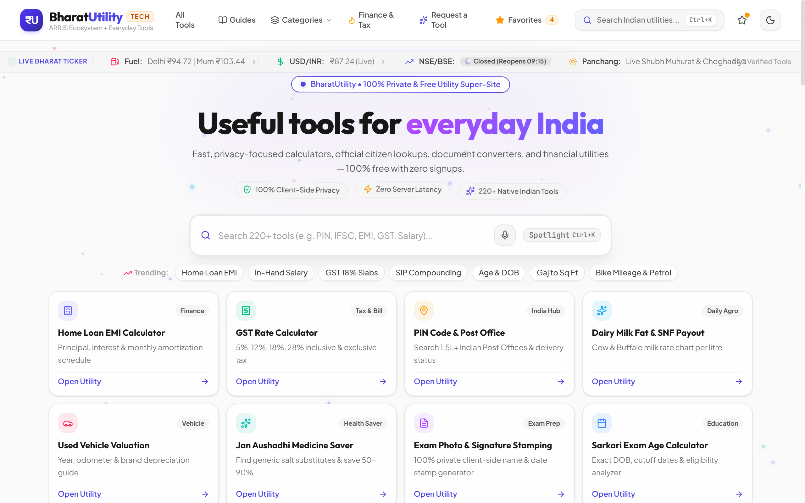
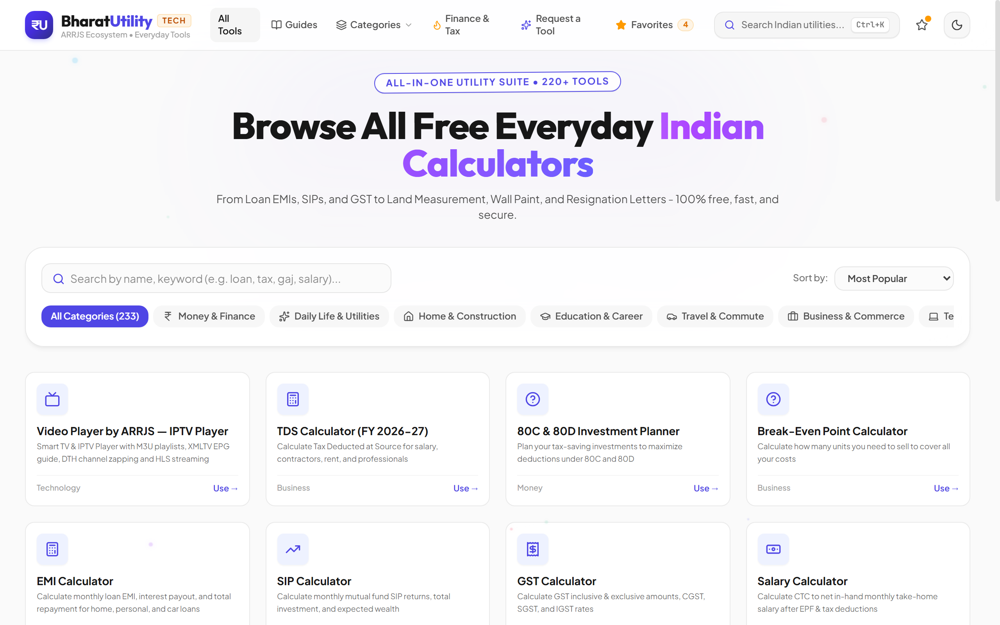
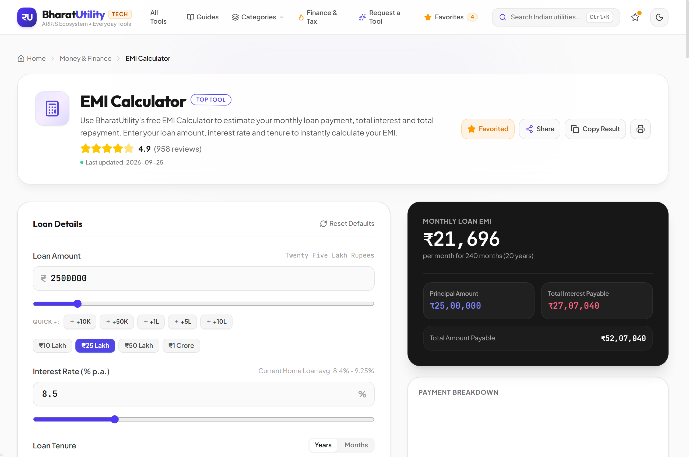
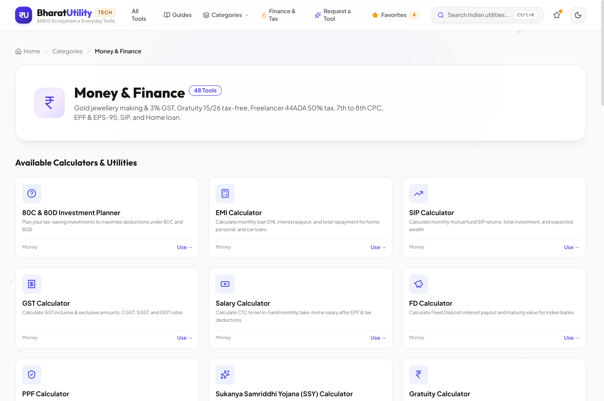
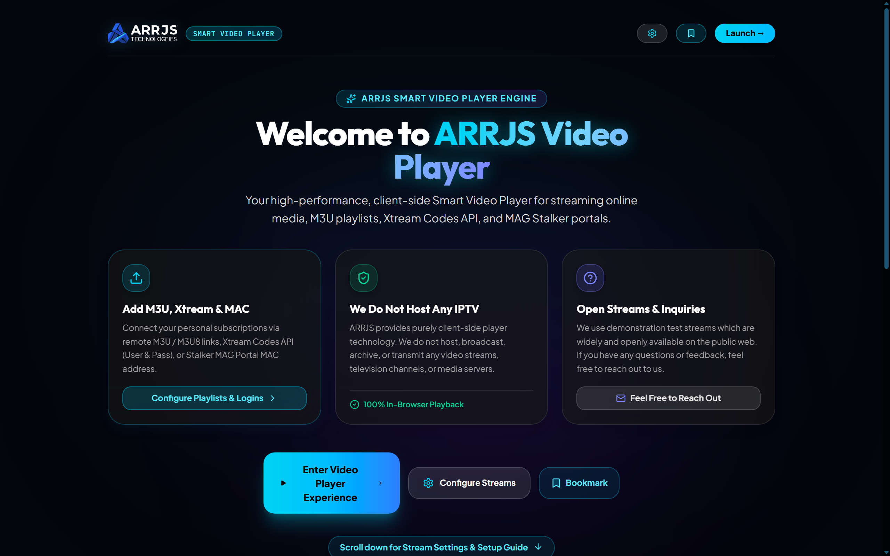
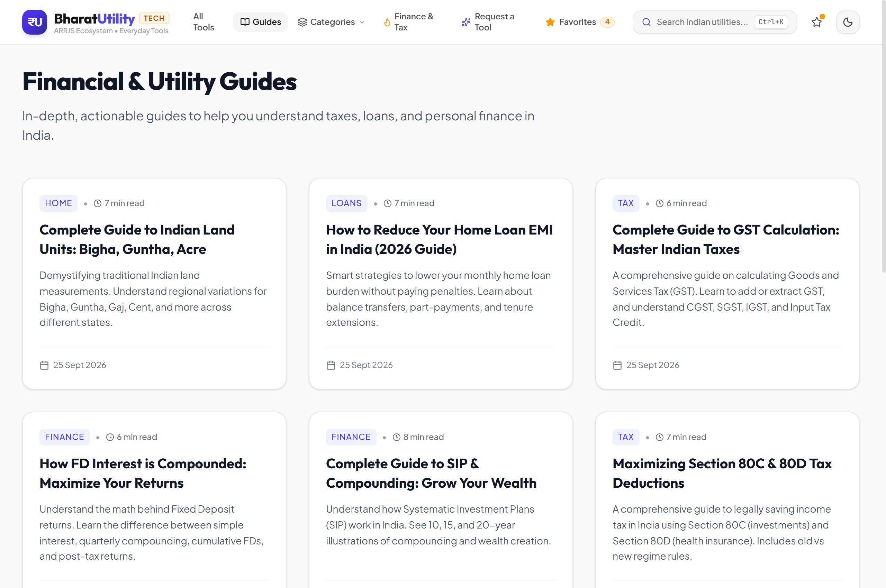
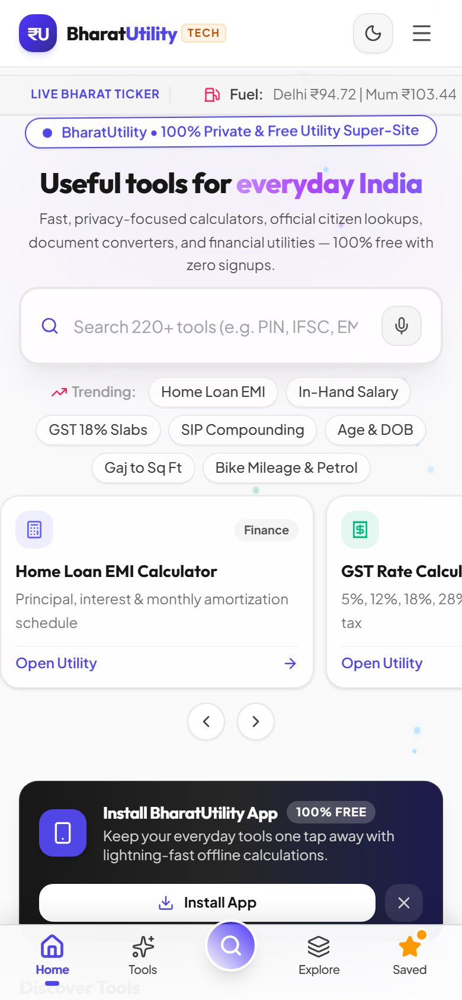

# BharatUtility — India's Digital Utility Super-Site 🇮🇳

[](LICENSE)
[](https://react.dev/)
[](https://www.typescriptlang.org/)
[](https://vitejs.dev/)
[](https://tailwindcss.com/)
[](https://bharatutility.tech)

> **India's open-source digital utility platform with 233+ practical online calculators, converters, civic lookups, and everyday tools.**

---

## 🚀 Try BharatUtility

Explore 233+ practical tools for everyday India — calculators, converters, financial utilities, document tools, civic lookups, and more directly in your browser with zero installation or signups.

### [🌐 Open BharatUtility Live Platform](https://bharatutility.tech)

[Live Demo](https://bharatutility.tech/) · [Browse Tools](https://bharatutility.tech/tools) · [Contribute](CONTRIBUTING.md) · [Report an Issue](https://github.com/Ashwinpatilr236/bharatutility/issues/new/choose)

---

## 📸 See BharatUtility in Action

### Homepage & Smart Discovery


### Core Product Experience

| Tool Discovery (233+ Tools across 13 Categories) | Interactive Loan EMI Calculator |
| :---: | :---: |
|  |  |

| Category Exploration (Money & Finance) | Smart Video Player & IPTV Engine |
| :---: | :---: |
|  |  |

| Financial & Civic Guides | Responsive Mobile Experience |
| :---: | :---: |
|  |  |

---

## 💡 What is BharatUtility?

Everyday utility calculations in India often require jumping between ad-heavy websites, out-of-date formula blogs, or complicated software. BharatUtility was created to provide a unified, clean, privacy-conscious suite of everyday tools tailored to Indian financial rules, regional measurement units, and civic realities.

- **Fast & Web-Based**: All tools are accessible instantly from any modern web browser — no app installation, registration, or paywalls required.
- **Privacy-Conscious Architecture**: Many calculation tools process inputs directly in the browser, helping keep ordinary calculation data local to the user's session.
- **India-Centric Rules**: Pre-configured with Indian numbering notation (Lakhs and Crores), state-wise land units, current tax slabs, and local regulatory formulas.
- **Unified Platform**: A single home for financial calculators, civic lookups, document helpers, education converters, and media streaming tools.

---

## 🌟 Key Features

BharatUtility organizes **233+ interactive tools** across **13 core categories**:

- 💰 **Financial & Tax Calculators**: Loan EMI (Home, Personal, Car), SIP Compounding, SWP, Lump Sum, FD quarterly interest compounding, RD, Post Office MIS, Income Tax (Old vs. New Regime comparisons), GST Invoicing & Reversals, Freelancer Section 44ADA Presumptive Tax, Capital Gains (LTCG / STCG), Gratuity (15/26 formula), and Gold/Silver making charge estimators.
- 📄 **Document & Legal Utilities**: Rent agreement stamp duty estimators, legal application letter templates, non-judicial stamp paper value guides, and client-side PDF utilities.
- 🎓 **Education & Career**: Sarkari exam age eligibility analyzer, college cut-off percentile calculator, board percentage converter, and CGPA to percentage estimators.
- 🚗 **Vehicle & Travel Utilities**: IRCTC Tatkal booking countdown timer, train coach/berth position locator, vehicle resale valuation, trip fuel cost estimator, and NHAI FASTag toll fare guides.
- 🏡 **Construction & Real Estate**: Multi-state Indian land area converter (Bigha, Guntha, Gaj, Biswa, Ground, Cent, Acre, Sq Ft), state electricity bill slab estimators, tile and flooring estimators, and wall paint quantity planners.
- ⚡ **Everyday Civic & Lifestyle**: Dairy milk Fat & SNF pricing formula, Indian baby names by Rashi & Nakshatra, Vedic Choghadiya Muhurat, Jan Aushadhi generic medicine cost comparison, and stock market trading hours tracker.
- 📺 **ARRJS IPTV & Media Utilities**: Modern TV-ready Smart Video Player with M3U playlist parsing, HLS (.m3u8) adaptive streaming, spatial D-pad navigation, channel categories, favorites, mini guide, and numeric zapping.

---

## 🛠️ Technology Stack

BharatUtility is built with a modern, performant, and lightweight frontend stack:

- **Frontend Core**: [React 19](https://react.dev/) + [TypeScript 5.8](https://www.typescriptlang.org/)
- **Bundler & Dev Server**: [Vite 6](https://vitejs.dev/)
- **Styling**: [Tailwind CSS 4](https://tailwindcss.com/) with native dark mode support
- **Icons**: [Lucide React](https://lucide.dev/)
- **Charts & Visualizations**: [Recharts](https://recharts.org/)
- **Media Player Engine**: [HLS.js](https://github.com/video-dev/hls.js)
- **Serving & Middleware**: [Express 4](https://expressjs.com/) via [tsx](https://github.com/privatenumber/tsx)
- **Database & Telemetry**: [Supabase](https://supabase.com/) (`@supabase/supabase-js`)

---

## 📁 Project Structure

```text
bharatutility/
├── docs/
│   └── screenshots/            # Verified product screenshots for GitHub documentation
├── public/                     # Static assets, favicon, icons, sitemap.xml, robots.txt
├── scripts/                    # Automation scripts (dynamic sitemaps, SEO audits)
├── src/
│   ├── components/
│   │   ├── calculators/        # Individual calculator suites and formula engines
│   │   ├── common/             # Global header, footer, command palette, toasts
│   │   ├── home/               # Homepage hero, category panel, discovery widgets
│   │   ├── tools/              # Reusable tool page container and shell
│   │   └── views/              # Full page views (All Tools, Categories, Guides, Legal)
│   ├── context/                # AppContext for navigation, favorites, routing, and theme
│   ├── data/                   # Data registries (categories.ts, toolsRegistry.ts, contentRegistry.ts)
│   ├── services/               # Client services (SupabaseClient, AnalyticsService, adminStore)
│   ├── utils/                  # Mathematical formulas, formatters, and SEO helpers
│   ├── App.tsx                 # Root application component and view router
│   ├── main.tsx                # React DOM mount entry point
│   └── index.css               # Core design tokens and Tailwind directives
├── supabase/                   # Supabase schema definitions and database migrations
├── .env.example                # Safe environment configuration template
├── netlify.toml                # Netlify deployment and SPA routing rules
├── server.ts                   # Express server entry point
├── package.json                # Project dependencies and script declarations
└── vite.config.ts              # Vite bundling, Tailwind plugin, and path aliases
```

---

## 🌍 Open Source

BharatUtility is an open-source project released under the **MIT License**. The repository is publicly maintained for transparency, community feedback, and developer collaboration. You are welcome to inspect the source code, open issues for feature requests or formula improvements, suggest new tools, or submit pull requests.

---

## 🤝 Contributing

Contributions to BharatUtility are warmly welcomed from developers, designers, and domain experts!

For local development setup, environment variables, coding standards, testing instructions, and pull request guidelines, please see the complete:

👉 **[Contributing Guide (CONTRIBUTING.md)](CONTRIBUTING.md)**

---

## 🔒 Security

For security vulnerability reports or sensitive concerns, please review our [Security Policy](SECURITY.md) and contact us privately at **arrjstechnologies@gmail.com**. Please do not report security vulnerabilities through public GitHub issues.

---

## 🗺️ Community Roadmap

The project roadmap is community-driven and continuously evolves based on user suggestions:

- [ ] **Expanded Regional Utilities**: Adding state-specific agricultural, land, and municipal bill calculators.
- [ ] **Accessibility (a11y) Refinements**: Continuous keyboard navigation and screen-reader optimizations across complex calculator forms.
- [ ] **Multi-Language Interfaces (i18n)**: Introducing Hindi, Marathi, Gujarati, Tamil, and Bengali localized interfaces for high-traffic tools.
- [ ] **Enhanced Offline PWA Capabilities**: Expanding service worker caching for complete offline operation of all core calculators.
- [ ] **Community Contribution Tooling**: Reusable scaffolding for rapid community addition of new Indian utility formulas.

---

## 📄 License

This project is licensed under the **MIT License** — see the [LICENSE](LICENSE) file for details.

---

© 2026 BharatUtility Contributors & ARRJS Technologies. Built for everyday India.
